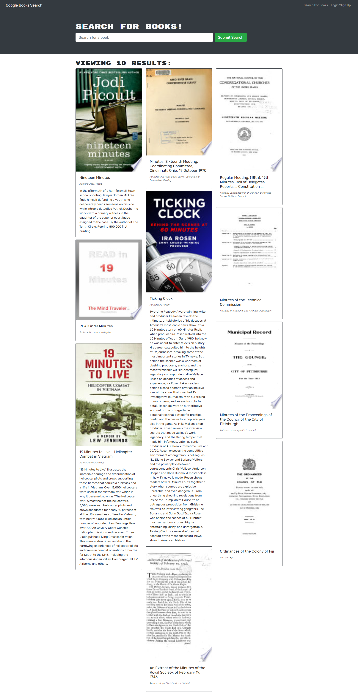

# 21-book-search-engine-mern

  

  # Table of Contents       

* [License](#license)

 * [Description](#description)
 * [Usage](#usage)

 * [Author](#author)
 * [Contributors](#contributors)
 * [Contact](#contact)
 * [Link](#link)
 * [Screenshot](#screenshot)
 
## License
    
    This project is licensed under the MIT
 
 ## Description:
 * This app allows the user to search for books or create and account to save searched books.

 ## Usage:

 * This app allows the user to find books and create a reading list
 

 

 
 ### Author:
  Rebecca Lacer 
 
 
 ### Contributors:
  N/A
 
 
 ### Contact
 
* Github: https://github.com/RLacer
* Email: r.a.lacer@hotmail.com

### Link
* Heroku Deployment: https://salty-wildwood-05963.herokuapp.com/
* GitHub Repo: https://github.com/RLacer/21-book-search-engine-mern

## Screenshot

<footer>This readme was generated using my homework assignment 9, Node.js readme generator.🏫</footer>